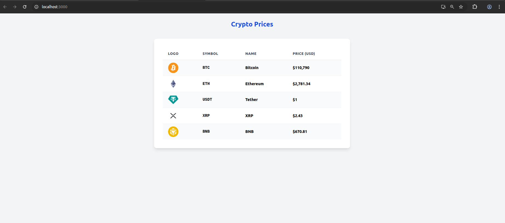

# Fintech Challenge – Crypto Prices Viewer

This project fetches and displays live cryptocurrency prices using the [CoinGecko API](https://www.coingecko.com/en/api).
It demonstrates how to consume a real-world fintech API and present financial data in a modern, responsive table.

## Features

- Fetches top cryptocurrencies by market cap
- Displays symbol, name, price (USD), and logo
- Responsive, clean UI styled with Tailwind CSS
- No API key required

## How It Works

- The app uses React and fetches data from:
  ```
  https://api.coingecko.com/api/v3/coins/markets?vs_currency=usd&order=market_cap_desc&per_page=5&page=1&sparkline=false
  ```
- Data is displayed in a styled table for easy comparison.

## Screenshot



## How to Run

1. Clone the repo
2. Install dependencies:
   ```
   npm install
   ```
3. Start the app:
   ```
   npm start
   ```
4. Open [http://localhost:3000](http://localhost:3000) in your browser

## API Reference

- [CoinGecko API Docs](https://www.coingecko.com/en/api)

---

**Note:**
This project is a demonstration of fetching and displaying financial data from a fintech API, fulfilling the requirements of the challenge.
